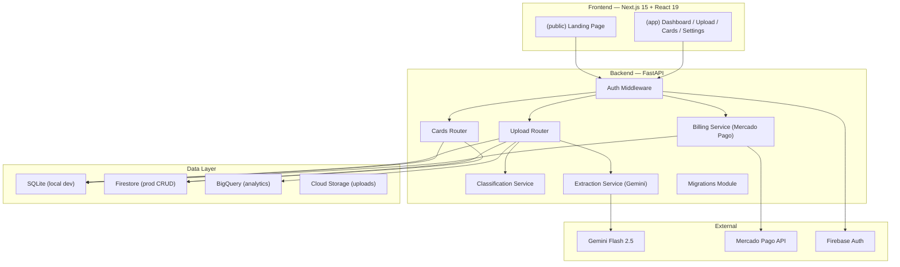
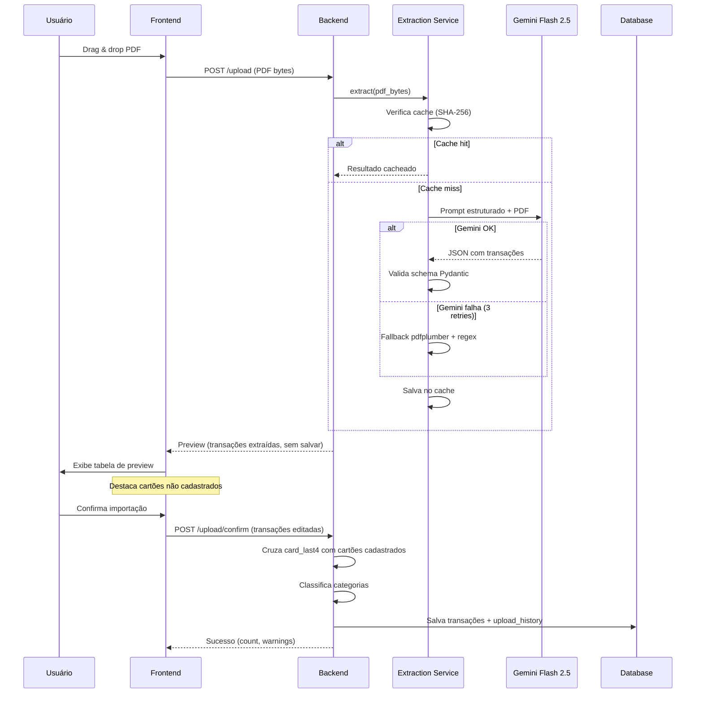
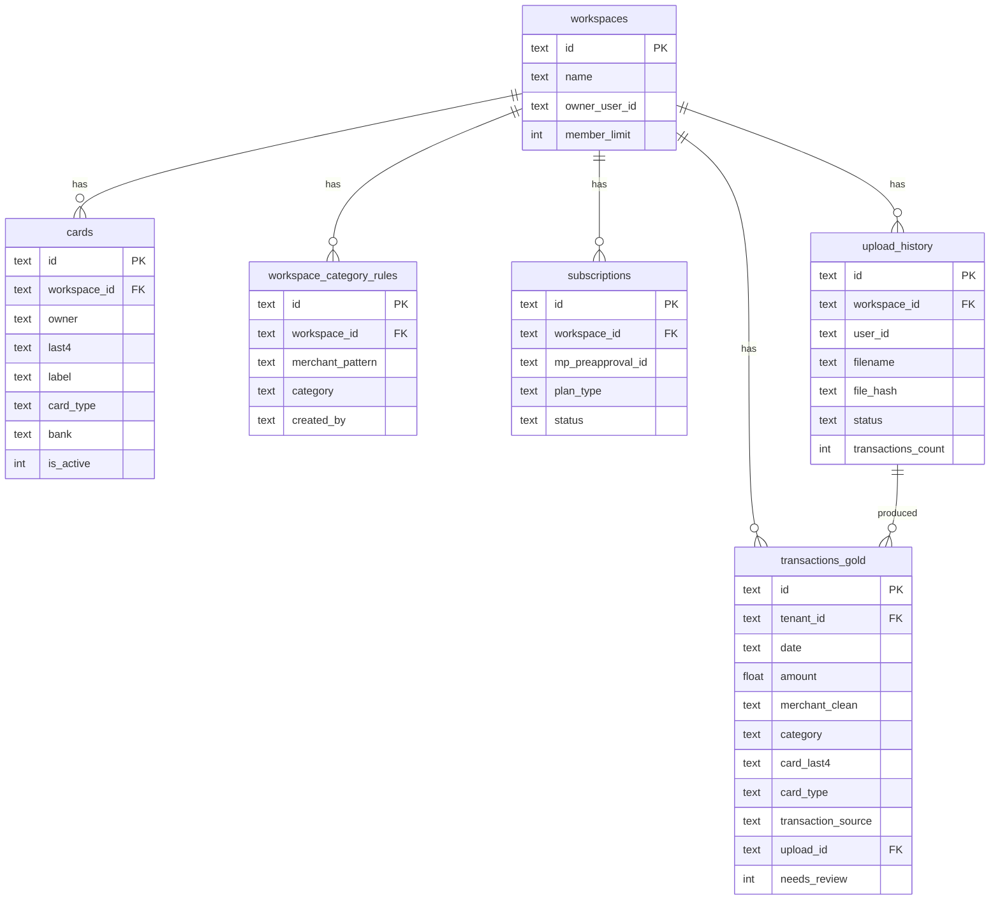

# Documento de Design — Finance Pilot → SaaS Platform Evolution

## Visão Geral

Este documento descreve o design técnico para transformar o Finance Pilot de uma ferramenta pessoal de finanças em uma plataforma SaaS multi-tenant. A evolução abrange 10 requisitos organizados em 8 tasks executadas sequencialmente, desde correções de segurança até monetização.

### Princípios de Design

1. **Isolamento por tenant**: Toda operação de dados filtra por `tenant_id` no nível da query — nunca em memória
2. **Preservação de dados**: As 1.572 transações existentes são intocáveis; migrações são aditivas e reversíveis
3. **Genericidade**: Zero referências pessoais hardcoded; toda lógica é parametrizada por workspace
4. **Mobile-first**: Interface responsiva seguindo princípios CRAP, zona do polegar e hierarquia visual
5. **Stack existente**: FastAPI + Next.js 15 + SQLite/Firestore/BigQuery — sem mudança de stack

### Diagrama de Arquitetura Alvo



## Arquitetura

### Estrutura de Módulos Backend

O backend atual concentra toda a lógica em `main.py` (~3.400 linhas). A evolução SaaS introduz novos módulos sem refatorar `main.py` em routers (isso fica para a Fase 2, Task 11). Os novos módulos são:

| Módulo | Responsabilidade | Dependências |
|--------|-----------------|--------------|
| `extraction_service.py` | Extração de PDF via Gemini Flash 2.5 + fallback pdfplumber | `google-generativeai`, `pdfplumber` |
| `categories.py` | Categorias padrão SaaS + regras por workspace | `database.py` |
| `billing_service.py` | Integração Mercado Pago (assinaturas recorrentes) | `mercadopago` SDK |
| `migrations/` | Migrações reversíveis de schema | `sqlite3` |
| `card_service.py` | CRUD de cartões com validação | `database.py` |

### Estrutura de Rotas Frontend

```
finance-pilot/frontend/app/
├── (public)/
│   ├── layout.tsx          # Layout sem sidebar, sem auth
│   └── page.tsx            # Landing page
├── (app)/
│   ├── layout.tsx          # AppShell com sidebar + auth guard
│   ├── page.tsx            # Dashboard (movido de app/page.tsx)
│   ├── transactions/
│   ├── upload/
│   │   └── page.tsx        # Novo fluxo: drag&drop PDF → preview → confirm
│   ├── cards/
│   │   └── page.tsx        # Gestão de cartões
│   ├── patrimonio/
│   └── workspace/
└── login/
    └── page.tsx
```

### Fluxo de Upload (Novo)



## Componentes e Interfaces

### Backend — Novos Endpoints

#### Cards API

```python
# POST /cards
class CardCreate(BaseModel):
    owner: str
    last4: str                                    # Exatamente 4 dígitos
    label: Optional[str] = None
    card_type: Literal["individual", "shared"]
    bank: str = "nubank"

# Response
class CardResponse(BaseModel):
    id: str
    workspace_id: str
    owner: str
    last4: str
    label: Optional[str]
    card_type: Literal["individual", "shared"]
    bank: str
    is_active: bool
    created_at: str
    updated_at: str

# Endpoints:
# POST   /cards              → Cria cartão (valida last4, uniqueness por workspace)
# GET    /cards              → Lista cartões do workspace atual
# PUT    /cards/{id}         → Atualiza cartão (somente do workspace atual)
# DELETE /cards/{id}         → Remove cartão (somente do workspace atual)
```

#### Upload API (Refatorado)

```python
# POST /upload — Retorna preview sem salvar
class UploadPreviewResponse(BaseModel):
    file_hash: str
    statement_type: Literal["credit_card", "current_account"]
    bank: str
    holder_name: str
    period_start: str
    period_end: str
    total_amount: float
    transactions: list[PreviewTransaction]
    unregistered_cards: list[str]           # card_last4 sem cadastro

class PreviewTransaction(BaseModel):
    date: str
    card_last4: Optional[str]
    description: str
    amount: float
    is_refund: bool
    suggested_category: str
    suggested_type: Optional[str]          # None se cartão não cadastrado
    needs_review: bool

# POST /upload/confirm — Salva transações confirmadas
class UploadConfirmRequest(BaseModel):
    file_hash: str
    transactions: list[ConfirmedTransaction]

class ConfirmedTransaction(BaseModel):
    date: str
    card_last4: Optional[str]
    description: str
    amount: float
    is_refund: bool
    category: str                          # Pode ter sido editada pelo usuário
    owner: str
```

#### Billing API

```python
# POST /billing/create-subscription
class CreateSubscriptionRequest(BaseModel):
    plan_type: Literal["pro", "familia"]

class CreateSubscriptionResponse(BaseModel):
    subscription_id: str
    init_point: str                        # URL de checkout do Mercado Pago

# POST /billing/webhook — Recebe IPN do Mercado Pago
# GET  /billing/status  — Status da assinatura do workspace
# POST /billing/cancel  — Cancela assinatura

class BillingStatusResponse(BaseModel):
    plan_type: Literal["free", "pro", "familia"]
    status: Literal["active", "paused", "cancelled", "pending", "none"]
    current_period_end: Optional[str]
```

#### Category Rules API

```python
# POST   /category-rules         → Cria regra customizada
# GET    /category-rules         → Lista regras do workspace
# PUT    /category-rules/{id}    → Atualiza regra
# DELETE /category-rules/{id}    → Remove regra

class CategoryRuleCreate(BaseModel):
    merchant_pattern: str
    category: str

class CategoryRuleResponse(BaseModel):
    id: str
    workspace_id: str
    merchant_pattern: str
    category: str
    created_by: Optional[str]
    created_at: str
```

### Backend — Extraction Service

```python
# extraction_service.py

class ExtractionService:
    """Extrai transações de PDFs usando Gemini Flash 2.5 com cache e fallback."""

    def __init__(self):
        self._cache: dict[str, ExtractedStatement] = {}  # hash → resultado
        self._model = genai.GenerativeModel("gemini-2.5-flash")

    def extract(self, pdf_bytes: bytes) -> ExtractedStatement:
        """Pipeline: cache → Gemini (3 retries) → pdfplumber fallback."""
        file_hash = hashlib.sha256(pdf_bytes).hexdigest()

        # 1. Cache lookup
        if file_hash in self._cache:
            return self._cache[file_hash]

        # 2. Gemini extraction com retry
        for attempt in range(3):
            try:
                result = self._call_gemini(pdf_bytes)
                validated = ExtractedStatement.model_validate_json(result)
                self._cache[file_hash] = validated
                return validated
            except Exception as e:
                if attempt < 2:
                    time.sleep(2 ** attempt)  # Exponential backoff: 1s, 2s, 4s
                    continue
                logger.warning("Gemini failed after 3 attempts: %s", e)

        # 3. Fallback: pdfplumber + regex
        result = self._fallback_pdfplumber(pdf_bytes)
        self._cache[file_hash] = result
        return result

    def _call_gemini(self, pdf_bytes: bytes) -> str:
        """Envia PDF ao Gemini com prompt estruturado."""
        # Prompt solicita JSON com schema ExtractedStatement
        ...

    def _fallback_pdfplumber(self, pdf_bytes: bytes) -> ExtractedStatement:
        """Parser regex para faturas Nubank como fallback."""
        ...
```

### Backend — Classification Service (Refatorado)

```python
# categories.py

DEFAULT_CATEGORIES = {
    "Alimentação": ["restaurante", "bar", "padaria", "lanchonete", "pizza", "sushi"],
    "Delivery": ["ifood", "rappi", "uber eats", "ifd*"],
    "Mercado": ["mercado", "supermercado", "hortifruti", "carrefour"],
    "Transporte": ["uber", "99", "combustivel", "posto", "estacionamento", "pedagio"],
    "Moradia": ["aluguel", "condominio", "luz", "energia", "agua", "internet"],
    "Saúde": ["farmacia", "drogaria", "medico", "academia", "totalpass"],
    "Educação": ["curso", "escola", "udemy", "alura", "linkedin"],
    "Lazer": ["cinema", "show", "ingresso", "parque"],
    "Streaming": ["netflix", "spotify", "disney", "hbo", "amazon prime", "youtube premium"],
    "Compras": ["shopee", "mercado livre", "amazon", "magazine"],
    "Assinaturas": ["google one", "icloud", "canva", "chatgpt", "github"],
    "Viagem": ["airbnb", "hotel", "pousada", "booking", "azul", "latam"],
    "Pets": ["petlove", "petshop", "veterinario"],
    "Impostos/Taxas": ["iof", "anuidade", "taxa"],
    "Transferência": ["pix", "ted", "transferencia"],
    "Outros": [],
}

class ClassificationService:
    """Classificação em 3 níveis de prioridade."""

    def classify(self, merchant_clean: str, workspace_id: str) -> ClassificationResult:
        # 1. Regra do workspace (match exato por merchant_clean)
        rule = self._get_workspace_rule(workspace_id, merchant_clean)
        if rule:
            return ClassificationResult(category=rule.category, needs_review=False)

        # 2. Keywords genéricos (match parcial)
        category = self._match_default_keywords(merchant_clean)
        if category and category != "Outros":
            return ClassificationResult(category=category, needs_review=False)

        # 3. Fallback
        return ClassificationResult(category="Outros", needs_review=True)
```

### Backend — Billing Service

```python
# billing_service.py

class BillingService:
    """Integração com Mercado Pago para assinaturas recorrentes."""

    PLAN_CONFIG = {
        "pro":     {"amount": 19.0, "reason": "Finance Pilot Pro"},
        "familia": {"amount": 39.0, "reason": "Finance Pilot Família"},
    }

    PLAN_LIMITS = {
        "free":    {"uploads_month": 2, "history_months": 3, "members": 1, "cards": 2},
        "pro":     {"uploads_month": -1, "history_months": 12, "members": 1, "cards": 5},
        "familia": {"uploads_month": -1, "history_months": -1, "members": 4, "cards": 10},
    }

    def create_subscription(self, workspace_id: str, plan_type: str) -> dict:
        """Cria preapproval no Mercado Pago, retorna init_point."""
        ...

    def process_webhook(self, payload: dict) -> None:
        """Processa IPN do Mercado Pago. Idempotente."""
        ...

    def check_limit(self, workspace_id: str, resource: str) -> bool:
        """Verifica se workspace pode executar operação dentro do plano."""
        ...
```

### Frontend — Novos Componentes

| Componente | Localização | Responsabilidade |
|-----------|-------------|-----------------|
| `LandingPage` | `(public)/page.tsx` | Hero, Como Funciona, Pricing, FAQ, CTA |
| `UploadForm` (refatorado) | `(app)/upload/page.tsx` | Drag&drop PDF/CSV, preview, confirm |
| `UploadPreview` | `components/UploadPreview.tsx` | Tabela de transações extraídas com highlights |
| `CardManager` | `(app)/cards/page.tsx` | CRUD de cartões com formulário Zod |
| `CardOnboarding` | `components/CardOnboarding.tsx` | Modal pós-upload para classificar cartões detectados |
| `PricingTable` | `components/PricingTable.tsx` | Tabela de planos Free/Pro/Família |

#### Padrões Frontend (conforme manulpadraofront.md)

- **Estado global**: Zustand para workspace ativo, plano, cartões
- **Formulários**: React Hook Form + Zod para validação de cartões e regras de categoria
- **Data fetching**: TanStack Query + Axios (proibido `useEffect` para fetch)
- **Estilização**: Tailwind CSS + Radix UI para modais e selects acessíveis
- **Testes E2E**: Playwright para fluxos críticos (upload, cards, billing)

## Modelos de Dados

### Novas Tabelas

```sql
-- Cartões cadastrados por workspace
CREATE TABLE cards (
    id TEXT PRIMARY KEY,
    workspace_id TEXT NOT NULL,
    owner TEXT NOT NULL,
    last4 TEXT NOT NULL CHECK(length(last4) = 4 AND last4 GLOB '[0-9][0-9][0-9][0-9]'),
    label TEXT,
    card_type TEXT NOT NULL CHECK(card_type IN ('individual', 'shared')),
    bank TEXT DEFAULT 'nubank',
    is_active INTEGER DEFAULT 1,
    created_at TIMESTAMP DEFAULT CURRENT_TIMESTAMP,
    updated_at TIMESTAMP DEFAULT CURRENT_TIMESTAMP,
    UNIQUE(workspace_id, last4)
);

-- Regras de categoria customizadas por workspace
CREATE TABLE workspace_category_rules (
    id TEXT PRIMARY KEY,
    workspace_id TEXT NOT NULL,
    merchant_pattern TEXT NOT NULL,
    category TEXT NOT NULL,
    created_by TEXT,
    created_at TIMESTAMP DEFAULT CURRENT_TIMESTAMP,
    UNIQUE(workspace_id, merchant_pattern)
);

-- Assinaturas (billing via Mercado Pago)
CREATE TABLE subscriptions (
    id TEXT PRIMARY KEY,
    workspace_id TEXT NOT NULL,
    mp_preapproval_id TEXT,
    plan_type TEXT NOT NULL DEFAULT 'free' CHECK(plan_type IN ('free', 'pro', 'familia')),
    status TEXT NOT NULL DEFAULT 'active' CHECK(status IN ('active', 'paused', 'cancelled', 'pending')),
    trial_ends_at TIMESTAMP,
    current_period_start TIMESTAMP,
    current_period_end TIMESTAMP,
    created_at TIMESTAMP DEFAULT CURRENT_TIMESTAMP,
    updated_at TIMESTAMP DEFAULT CURRENT_TIMESTAMP
);

-- Histórico de uploads
CREATE TABLE upload_history (
    id TEXT PRIMARY KEY,
    workspace_id TEXT NOT NULL,
    user_id TEXT NOT NULL,
    filename TEXT NOT NULL,
    file_hash TEXT NOT NULL,
    file_size_bytes INTEGER,
    statement_type TEXT CHECK(statement_type IN ('credit_card', 'current_account')),
    bank TEXT,
    period_start TEXT,
    period_end TEXT,
    transactions_count INTEGER,
    status TEXT NOT NULL CHECK(status IN ('processing', 'completed', 'failed', 'reverted')),
    error_message TEXT,
    created_at TIMESTAMP DEFAULT CURRENT_TIMESTAMP
);
```

### Alterações em Tabelas Existentes

```sql
-- Migração: adicionar colunas à transactions_gold
ALTER TABLE transactions_gold ADD COLUMN card_last4 TEXT;
ALTER TABLE transactions_gold ADD COLUMN card_type TEXT;
ALTER TABLE transactions_gold ADD COLUMN is_refund INTEGER DEFAULT 0;
ALTER TABLE transactions_gold ADD COLUMN transaction_source TEXT DEFAULT 'legacy_csv';
ALTER TABLE transactions_gold ADD COLUMN upload_id TEXT;
ALTER TABLE transactions_gold ADD COLUMN needs_review INTEGER DEFAULT 0;

-- Preencher defaults para dados legados
UPDATE transactions_gold
SET transaction_source = 'legacy_csv',
    card_last4 = NULL,
    needs_review = 0
WHERE transaction_source IS NULL;
```

### Rollback da Migração

```sql
-- Rollback: remover colunas adicionadas
-- SQLite não suporta DROP COLUMN diretamente antes da versão 3.35.0
-- Estratégia: criar tabela temporária sem as colunas novas, copiar dados, renomear

CREATE TABLE transactions_gold_backup AS
SELECT id, tenant_id, date, month_ref, amount, merchant_clean,
       category, subcategory, owner, type, created_at
FROM transactions_gold;

DROP TABLE transactions_gold;
ALTER TABLE transactions_gold_backup RENAME TO transactions_gold;

-- Remover tabelas novas
DROP TABLE IF EXISTS cards;
DROP TABLE IF EXISTS workspace_category_rules;
DROP TABLE IF EXISTS subscriptions;
DROP TABLE IF EXISTS upload_history;
```

### Diagrama ER




## Propriedades de Corretude

*Uma propriedade é uma característica ou comportamento que deve ser verdadeiro em todas as execuções válidas de um sistema — essencialmente, uma declaração formal sobre o que o sistema deve fazer. Propriedades servem como ponte entre especificações legíveis por humanos e garantias de corretude verificáveis por máquina.*

### Propriedade 1: Validação de cartão — last4 e card_type

*Para qualquer* string de entrada para o campo `last4`, o sistema SHALL aceitar a string se e somente se ela contiver exatamente 4 caracteres numéricos (`0-9`). *Para qualquer* valor de `card_type`, o sistema SHALL aceitar se e somente se o valor for `"individual"` ou `"shared"`.

**Valida: Requisitos 3.2, 3.7**

### Propriedade 2: Unicidade de cartão por workspace

*Para qualquer* workspace e *para qualquer* cartão já cadastrado com `last4 = X`, uma tentativa de criar outro cartão com `last4 = X` no mesmo workspace SHALL ser rejeitada. Cartões com o mesmo `last4` em workspaces diferentes SHALL ser aceitos.

**Valida: Requisito 3.3**

### Propriedade 3: Isolamento de cartões por tenant

*Para qualquer* conjunto de cartões distribuídos entre múltiplos workspaces, uma operação de leitura (GET), atualização (PUT) ou remoção (DELETE) executada no contexto de um workspace SHALL afetar somente cartões pertencentes a esse workspace. Cartões de outros workspaces SHALL permanecer inalterados e invisíveis.

**Valida: Requisitos 3.4, 3.5, 3.6**

### Propriedade 4: Cadeia de prioridade da classificação

*Para qualquer* merchant_clean e workspace_id, o Serviço_de_Classificação SHALL retornar a categoria seguindo estritamente a ordem: (1) se existe regra do workspace com match exato, retorna a categoria da regra; (2) senão, se existe match parcial com keywords das categorias padrão, retorna a categoria correspondente; (3) senão, retorna `"Outros"` com `needs_review = true`.

**Valida: Requisitos 4.2, 4.3, 4.6**

### Propriedade 5: Determinação de tipo por cartão cadastrado

*Para qualquer* transação com `card_last4` e *para qualquer* conjunto de cartões cadastrados no workspace, se `card_last4` corresponde a um cartão cadastrado, o `card_type` da transação SHALL ser igual ao `card_type` do cartão. Se `card_last4` não corresponde a nenhum cartão cadastrado, a transação SHALL ter `needs_review = true`.

**Valida: Requisitos 2.2, 6.2, 6.3**

### Propriedade 6: Owners dinâmicos do workspace

*Para qualquer* workspace com um conjunto de membros M, o endpoint `GET /owners` SHALL retornar exatamente os nomes dos membros em M — sem nomes estáticos de configuração e sem membros de outros workspaces.

**Valida: Requisitos 2.1, 2.3**

### Propriedade 7: Round-trip do schema de extração

*Para qualquer* objeto `ExtractedTransaction` válido, serializar para JSON e deserializar de volta SHALL produzir um objeto equivalente ao original, preservando todos os campos: date, card_last4, description, amount, is_refund, is_installment, installment_current, installment_total, original_currency.

**Valida: Requisitos 5.2, 5.6**

### Propriedade 8: Cache de extração por hash SHA-256

*Para qualquer* conteúdo de PDF, a primeira chamada ao `ExtractionService.extract()` SHALL processar o PDF (via Gemini ou fallback). Uma segunda chamada com o mesmo conteúdo (mesmo hash SHA-256) SHALL retornar o resultado cacheado sem invocar a API do Gemini. Uma chamada com conteúdo diferente SHALL processar normalmente.

**Valida: Requisito 5.3**

### Propriedade 9: Registro de upload_history na confirmação

*Para qualquer* confirmação de upload bem-sucedida, o sistema SHALL criar exatamente um registro na tabela `upload_history` contendo: filename, file_hash, statement_type, bank, period_start, period_end, transactions_count e status='completed'. O `transactions_count` SHALL ser igual ao número de transações efetivamente salvas.

**Valida: Requisito 6.6**

### Propriedade 10: Idempotência do webhook de billing

*Para qualquer* payload de webhook do Mercado Pago, processar o mesmo payload N vezes (N ≥ 1) SHALL produzir o mesmo estado final da assinatura que processá-lo exatamente uma vez. Não SHALL haver duplicação de registros ou alterações de status inconsistentes.

**Valida: Requisito 8.8**

### Propriedade 11: Enforcement de limites de plano

*Para qualquer* workspace com plano P e *para qualquer* recurso R com limite L(P, R), se o uso atual do recurso é ≥ L(P, R), a operação SHALL ser rejeitada. Se o uso atual é < L(P, R), a operação SHALL ser permitida. Limites: uploads/mês (Free=2, Pro=∞, Família=∞), membros (Free=1, Pro=1, Família=4), cartões (Free=2, Pro=5, Família=10).

**Valida: Requisito 8.5**

### Propriedade 12: Webhook atualiza status e plan_type corretamente

*Para qualquer* payload de webhook válido do Mercado Pago com status S e preapproval_id correspondente a uma assinatura existente, o sistema SHALL atualizar o campo `status` da assinatura para o valor mapeado de S e o `plan_type` do workspace para o plano correspondente. Todos os campos obrigatórios da assinatura (id, workspace_id, mp_preapproval_id, plan_type, status, created_at, updated_at) SHALL estar presentes após a atualização.

**Valida: Requisitos 8.2, 8.7**

## Tratamento de Erros

### Backend

| Cenário | Código HTTP | Comportamento |
|---------|-------------|---------------|
| Tenant_id ausente ou inválido | 400 | Rejeita request antes de qualquer query |
| Token Firebase inválido/expirado | 401 | Rejeita com mensagem clara |
| Acesso a recurso de outro workspace | 403 | Rejeita sem revelar existência do recurso |
| Cartão duplicado (last4 no workspace) | 409 | Retorna conflito com detalhes |
| Limite de plano excedido | 402 | Retorna limite atingido + sugestão de upgrade |
| PDF inválido ou corrompido | 422 | Retorna erro de validação com detalhes |
| Gemini indisponível (após 3 retries) | 200 | Usa fallback pdfplumber; se falhar, retorna 503 |
| Webhook Mercado Pago com payload inválido | 400 | Loga e rejeita; não altera estado |
| Webhook duplicado (idempotência) | 200 | Aceita sem efeito colateral |
| Migração falha no meio | Rollback | Script de rollback reverte schema |
| Upload de arquivo > 10MB | 413 | Rejeita com limite informado |
| Arquivo não é PDF nem CSV | 400 | Rejeita com formatos aceitos |

### Frontend

| Cenário | Comportamento |
|---------|---------------|
| Erro 401 | Redireciona para `/login` via interceptor Axios |
| Erro 402 (limite) | Exibe modal de upgrade com link para billing |
| Erro 409 (cartão duplicado) | Toast com mensagem "Cartão já cadastrado" |
| Erro de rede | Toast com retry automático via TanStack Query |
| Preview com cartões não cadastrados | Highlight amarelo + modal de onboarding de cartões |
| Upload em progresso | Skeleton + barra de progresso; desabilita botão |

### Estratégia de Retry

- **Gemini API**: 3 tentativas com exponential backoff (1s, 2s, 4s)
- **Mercado Pago API**: 2 tentativas com backoff linear (2s, 4s)
- **Frontend (TanStack Query)**: 3 retries com backoff exponencial para queries; 0 retries para mutations

## Estratégia de Testes

### Abordagem Dual

A estratégia combina testes unitários (exemplos específicos) com testes baseados em propriedades (verificação universal) para cobertura abrangente.

### Testes Baseados em Propriedades (PBT)

**Biblioteca**: `hypothesis` (Python) — padrão para PBT em Python, integra com pytest.

**Configuração**: Mínimo 100 iterações por propriedade (`@settings(max_examples=100)`).

**Tag de cada teste**: Comentário referenciando a propriedade do design:
```python
# Feature: saas-platform-evolution, Property 1: Validação de cartão — last4 e card_type
```

**Propriedades a implementar como PBT:**

| # | Propriedade | Módulo Testado |
|---|------------|----------------|
| 1 | Validação last4 + card_type | `card_service.py` |
| 2 | Unicidade de cartão por workspace | `card_service.py` |
| 3 | Isolamento de cartões por tenant | `card_service.py` + `main.py` |
| 4 | Cadeia de prioridade da classificação | `categories.py` |
| 5 | Determinação de tipo por cartão | `processor.py` / upload confirm |
| 6 | Owners dinâmicos do workspace | `main.py` |
| 7 | Round-trip schema de extração | `extraction_service.py` |
| 8 | Cache por SHA-256 | `extraction_service.py` |
| 9 | Registro de upload_history | upload confirm flow |
| 10 | Idempotência do webhook | `billing_service.py` |
| 11 | Enforcement de limites de plano | `billing_service.py` |
| 12 | Webhook atualiza status corretamente | `billing_service.py` |

### Testes Unitários (Exemplos)

| Área | Exemplos a Testar |
|------|-------------------|
| Cards API | Criação com dados válidos, rejeição de last4 inválido, rejeição de card_type inválido |
| Upload | Preview retorna sem salvar, confirm salva corretamente, rejeição de arquivo inválido |
| Classification | Categorias padrão reconhecem merchants conhecidos, fallback para "Outros" |
| Billing | Criação de subscription, status retrieval, cancelamento |
| Migration | Rollback restaura schema original, dados legados preservados |
| Landing Page | Seções presentes, redirect de usuário autenticado, meta tags SEO |

### Testes de Integração

| Fluxo | O que Verifica |
|-------|---------------|
| Upload end-to-end | PDF → extração → preview → confirm → transações no DB |
| Billing end-to-end | Create subscription → webhook → plan_type atualizado → limites aplicados |
| Tenant isolation | Dados de workspace A invisíveis para workspace B em todos os endpoints |
| Migration | Apply → verify schema → rollback → verify original schema |

### Testes E2E (Playwright)

Conforme `manulpadraofront.md`, Playwright é a ferramenta oficial para testes E2E:

| Jornada | Steps |
|---------|-------|
| Upload PDF | Login → Upload → Preview → Confirm → Dashboard atualiza |
| Gestão de cartões | Login → Cards → Criar → Editar → Deletar |
| Landing → Signup | Landing → CTA → Login/Signup → Dashboard |
| Upgrade de plano | Settings → Assinar Pro → Checkout MP → Retorno → Plano atualizado |

### Dependências de Teste

```
# Adicionar ao requirements.txt
hypothesis>=6.100.0,<7.0.0    # Property-based testing
pdfplumber>=0.11.0,<1.0.0     # PDF parsing (fallback + testes)
google-generativeai>=0.8.0     # Gemini SDK
mercadopago>=2.2.0,<3.0.0     # Mercado Pago SDK
```
