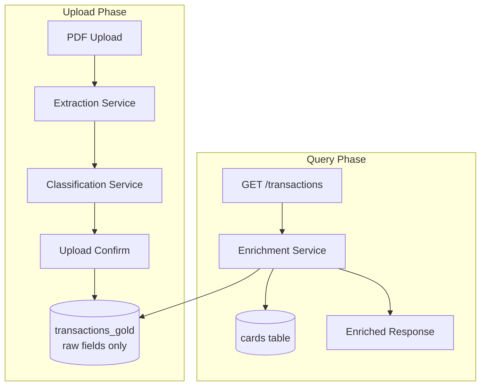

# Design Document: Upload Data Enrichment

## Overview

This feature refactors the upload/confirm and query pipeline to separate **raw data persistence** from **read-time enrichment**. Currently, the `POST /upload/confirm` endpoint computes `month_ref`, looks up card data, and stores enriched fields (`owner`, `type`, `card_type`) at write time. This couples the stored data to the enrichment logic at the time of upload.

The new design introduces an **Enrichment Service** that runs at query time (`GET /transactions`), computing `month_ref` and applying card metadata on the fly. The upload confirm step is simplified to store only raw extracted fields, preserving the original data for future reprocessing.

### Key Design Decisions

1. **Enrichment at read time, not write time** — Allows card metadata changes to propagate without re-uploading. Trades slightly more computation per query for data flexibility.
2. **Backward compatibility via fallback** — Transactions with pre-existing `month_ref` values use the stored value; only NULL values trigger computation.
3. **Enrichment as a pure function** — The enrichment logic is a stateless transformation over (transaction, card_map) pairs, making it testable and idempotent.

## Architecture



**Upload Phase** stores: `id`, `tenant_id`, `date`, `amount`, `merchant_clean`, `category`, `card_last4`, `is_refund`, `transaction_source`, `upload_id`, `created_at`.

**Query Phase** enriches each transaction with:
- `month_ref` — computed from `date` (or preserved if already stored)
- `owner` — from cards table lookup by `card_last4`
- `type` / `card_type` — from cards table lookup by `card_last4`

## Components and Interfaces

### 1. EnrichmentService (new module: `enrichment_service.py`)

A stateless service that enriches raw transaction rows with card metadata and computed `month_ref`.

```python
class EnrichmentService:
    def enrich_transactions(
        self,
        transactions: list[dict],
        card_map: dict[str, CardInfo],
    ) -> list[dict]:
        """Enrich a list of raw transaction dicts with card data and month_ref.
        
        Args:
            transactions: Raw transaction rows from the database.
            card_map: Mapping of card last4 -> CardInfo (owner, card_type).
        
        Returns:
            Enriched transaction dicts with month_ref, owner, type, card_type set.
        """
        ...

    def compute_month_ref(self, transaction: dict) -> str:
        """Compute month_ref for a single transaction.
        
        If transaction already has a non-empty month_ref, return it as-is.
        Otherwise, derive YYYY-MM from the transaction's date field.
        """
        ...

    def enrich_card_data(
        self,
        transaction: dict,
        card_map: dict[str, CardInfo],
    ) -> dict:
        """Apply card enrichment to a single transaction.
        
        If card_last4 matches a registered card, set owner/type/card_type
        from the card. Otherwise, preserve existing values.
        """
        ...
```

### 2. CardInfo (data class)

```python
@dataclass
class CardInfo:
    owner: str
    card_type: str  # "individual" or "shared"
```

### 3. Modified `POST /upload/confirm`

The confirm endpoint is simplified to:
- Store raw fields only (no card lookup for enrichment)
- Store `month_ref` as NULL
- Still classify `category` via ClassificationService (not card-dependent)
- Still store `card_last4` as a raw extracted field

### 4. Modified `GET /transactions`

The transactions endpoint is updated to:
1. Query raw transactions from `transactions_gold`
2. Load the workspace's card map from `cards` table
3. Call `EnrichmentService.enrich_transactions()` on the raw rows
4. Filter by computed `month_ref` range
5. Apply owner/type filters on enriched data
6. Return paginated, enriched results

### Interface Changes

No changes to the external API contract. The response schema remains identical:
```json
{
  "data": [
    {
      "id": "tx-...",
      "date": "2026-04-10",
      "month_ref": "2026-04",
      "amount": 25.50,
      "merchant_clean": "UBER TRIP",
      "category": "Transporte",
      "owner": "Victor",
      "type": "individual",
      "card_last4": "4535",
      "card_type": "individual",
      ...
    }
  ],
  "total": 42,
  "limit": 200,
  "offset": 0
}
```

## Data Models

### transactions_gold (modified write behavior)

| Column | Upload Phase | Query Phase |
|--------|-------------|-------------|
| `id` | Generated UUID | Read as-is |
| `tenant_id` | From workspace context | Read as-is |
| `date` | Raw extracted date (ISO) | Read as-is |
| `month_ref` | **NULL** (new behavior) | Computed or read stored |
| `amount` | Raw extracted amount | Read as-is |
| `merchant_clean` | Normalized merchant | Read as-is |
| `category` | From ClassificationService | Read as-is |
| `subcategory` | NULL | Read as-is |
| `owner` | **NULL** (new behavior) | Enriched from cards |
| `type` | **NULL** (new behavior) | Enriched from cards |
| `card_last4` | Raw extracted | Used for card lookup |
| `card_type` | **NULL** (new behavior) | Enriched from cards |
| `is_refund` | Raw extracted | Read as-is |
| `transaction_source` | "pdf_extraction" | Read as-is |
| `upload_id` | Generated upload ID | Read as-is |
| `needs_review` | Based on classification only | Read as-is |
| `created_at` | UTC timestamp | Read as-is |

### cards table (unchanged)

| Column | Type | Description |
|--------|------|-------------|
| `id` | TEXT | Primary key |
| `workspace_id` | TEXT | Tenant isolation |
| `owner` | TEXT | Card owner name |
| `last4` | TEXT | Last 4 digits |
| `card_type` | TEXT | "individual" or "shared" |
| `bank` | TEXT | Bank name |
| `is_active` | INTEGER | Active flag |

### CardInfo (runtime only, not persisted)

```python
@dataclass
class CardInfo:
    owner: str
    card_type: str  # "individual" | "shared"
```

Built at query time from the `cards` table filtered by `workspace_id`.

## Correctness Properties

*A property is a characteristic or behavior that should hold true across all valid executions of a system — essentially, a formal statement about what the system should do. Properties serve as the bridge between human-readable specifications and machine-verifiable correctness guarantees.*

### Property 1: Upload preserves raw date and stores NULL month_ref

*For any* valid transaction with a date string in ISO format (YYYY-MM-DD), when confirmed via the upload service, the stored transaction SHALL have its `date` field equal to the input date and its `month_ref` field set to NULL.

**Validates: Requirements 1.1, 1.2, 1.3**

### Property 2: Upload stores only raw fields without card-derived enrichment

*For any* confirmed transaction, regardless of whether its `card_last4` matches a registered card, the stored row in `transactions_gold` SHALL have `owner` set to NULL, `type` set to NULL, and `card_type` set to NULL.

**Validates: Requirements 4.1, 4.2**

### Property 3: Month_ref computation derives YYYY-MM from date

*For any* transaction with a valid ISO date (YYYY-MM-DD) and a NULL or empty `month_ref`, the enrichment service SHALL compute `month_ref` as the first 7 characters of the date (YYYY-MM). For transactions with a non-empty stored `month_ref`, the enrichment service SHALL return the stored value unchanged.

**Validates: Requirements 2.1, 2.2, 6.1, 6.2**

### Property 4: Enrichment is idempotent

*For any* set of transactions and card map, applying the enrichment function once and then applying it again to the result SHALL produce identical output.

**Validates: Requirements 2.4, 5.4**

### Property 5: Card enrichment applies registered card data

*For any* transaction whose `card_last4` matches a registered card in the card map, the enriched transaction SHALL have `owner` equal to the card's owner, `type` equal to the card's `card_type`, and `card_type` equal to the card's `card_type`.

**Validates: Requirements 3.1, 3.2, 3.3, 3.4, 6.3**

### Property 6: Missing or NULL card preserves stored values

*For any* transaction whose `card_last4` is NULL, empty, or does not match any entry in the card map, the enriched transaction SHALL preserve its existing `owner`, `type`, and `card_type` values from the database unchanged.

**Validates: Requirements 3.5, 3.6, 5.1, 5.2**

### Property 7: Enrichment reflects current card state

*For any* transaction and any sequence of card updates (add, modify, delete), querying the transaction after the card update SHALL reflect the current card state — not the state at upload time.

**Validates: Requirements 5.3**

### Property 8: Category is classified at upload time

*For any* confirmed transaction with a non-empty merchant description, the stored row SHALL have a non-NULL `category` field derived from the ClassificationService.

**Validates: Requirements 4.3**

## Error Handling

| Scenario | Behavior |
|----------|----------|
| Database write failure during confirm | Return HTTP 500 with descriptive error; no partial commits (SQLite transaction rollback) |
| Card table unavailable at query time | Return transactions without card enrichment (preserve stored values) |
| Invalid date format in stored transaction | Use stored `month_ref` if available; otherwise set `month_ref` to NULL and include in response |
| Empty transactions list in confirm | Return success with `saved_count: 0` |
| Card_last4 not in cards table | Return transaction with NULL `card_type`, preserve stored `owner`/`type` |

## Testing Strategy

### Property-Based Testing (Hypothesis)

The feature is well-suited for property-based testing because:
- The enrichment service is a pure function (transaction + card_map → enriched transaction)
- The month_ref computation is a pure derivation from date strings
- Properties are universal across all valid inputs (any date, any card configuration)

**Library**: `hypothesis` (already in requirements.txt, version ≥6.100.0)

**Configuration**: Minimum 100 examples per property test.

**Tag format**: `Feature: upload-data-enrichment, Property {N}: {title}`

Each correctness property maps to a single property-based test:

| Property | Test Focus | Generator Strategy |
|----------|-----------|-------------------|
| 1 | Upload stores raw date, NULL month_ref | Random ISO dates (YYYY-MM-DD) |
| 2 | Upload stores no card-derived fields | Random transactions with/without matching cards |
| 3 | Month_ref = YYYY-MM from date | Random ISO dates + optional pre-existing month_ref |
| 4 | Enrichment idempotence | Random transactions + random card maps |
| 5 | Card match → card data applied | Random cards + transactions with matching last4 |
| 6 | No card match → values preserved | Random transactions with unregistered last4 |
| 7 | Card updates reflected in queries | Random card CRUD sequences |
| 8 | Category classified at upload | Random merchant descriptions |

### Unit Tests (Example-Based)

- Database write failure returns HTTP 500 (Requirement 4.4)
- Response schema matches existing format (Requirement 6.4)
- Empty upload confirm returns success with 0 count
- Transactions with pre-existing month_ref are not recomputed

### Integration Tests

- Full upload → query flow with real SQLite database
- Card CRUD → query enrichment reflects changes
- Backward compatibility: query old transactions (with stored month_ref) alongside new ones (NULL month_ref)
